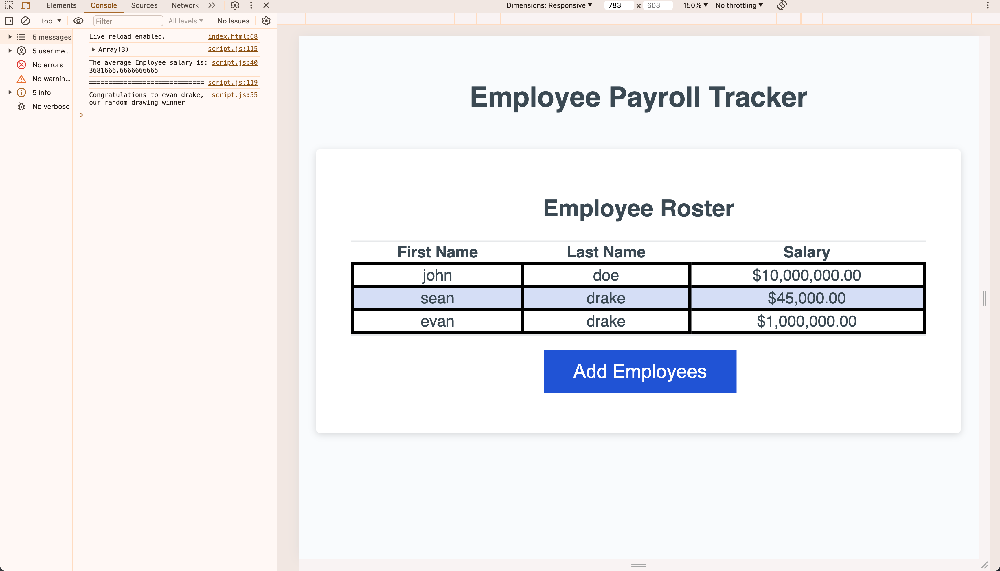

# Payroll App

## Description

A learning opportunity to enhance an existing code base to have functioning java script which covers the following acceptance criteria:

- WHEN I click the "Add employee" button
  THEN I am presented with a series of prompts asking for first name, last name, and salary
- WHEN I finish adding an employee
  THEN I am prompted to continue or cancel
- WHEN I choose to continue
  THEN I am prompted to add a new employee
- WHEN I choose to cancel
  THEN my employee data is displayed on the page sorted alphabetically by last name, and the console shows computed and aggregated data

## Installation

You may clone the repository for access to the project files directly to copy/paste as needed.

## Usage

This web project is currently deployed [on Github Pages](https://github.com/spd34/Employee-Payroll-Tracker)

The outcome of the project is to deliver a webpage that looks like the mock-up (see below) and meets all the acceptance criterion through the use of java script.

The screen shot provided shows the populated table for the application after a user has added employees, on the left. On the right is the console output displaying the average salary calculated for all the employees entered as well as a random selection from the entered employees into a drawing.

